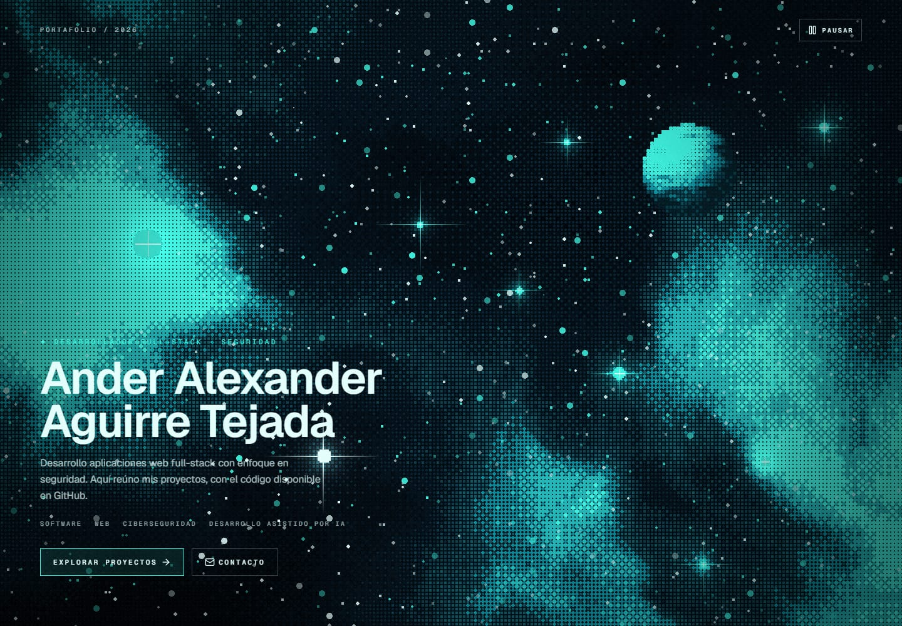
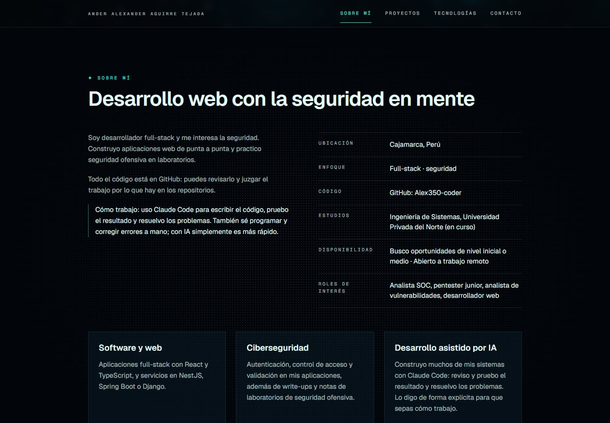
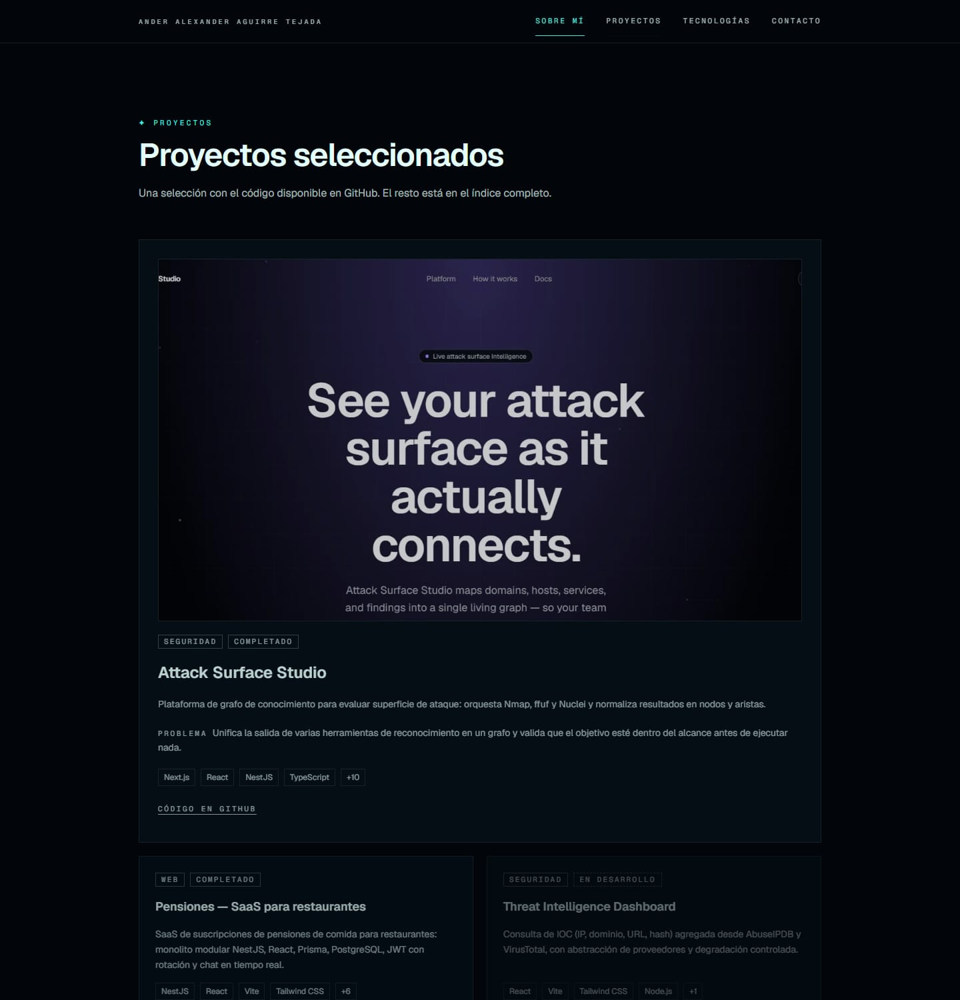
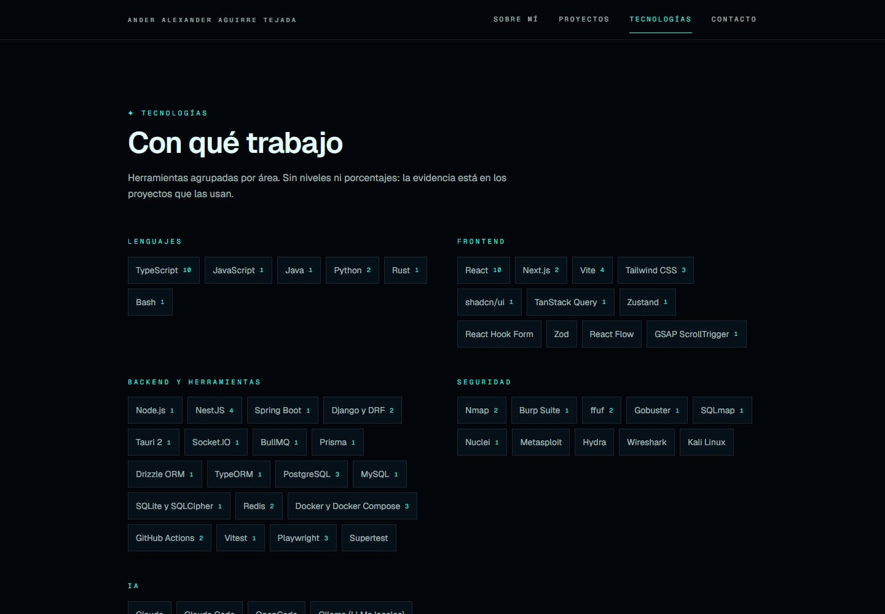
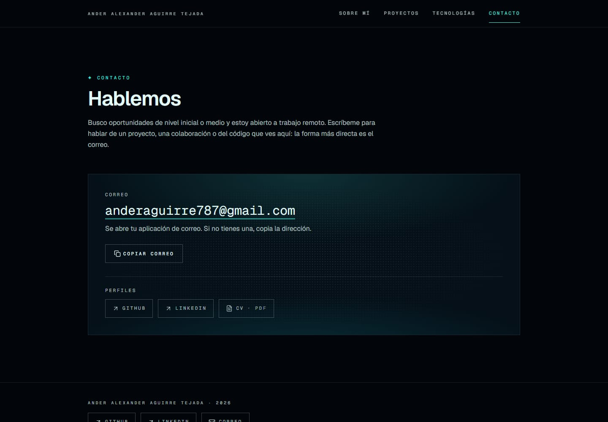
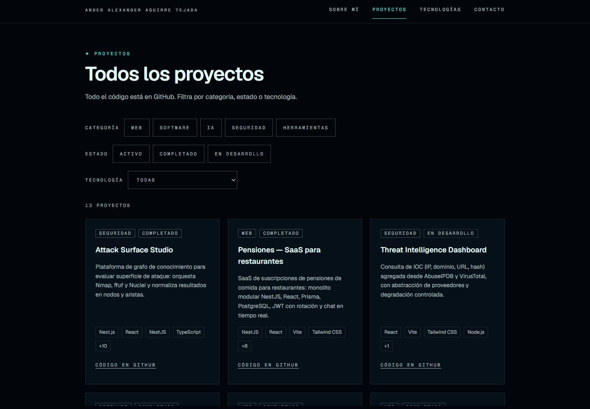
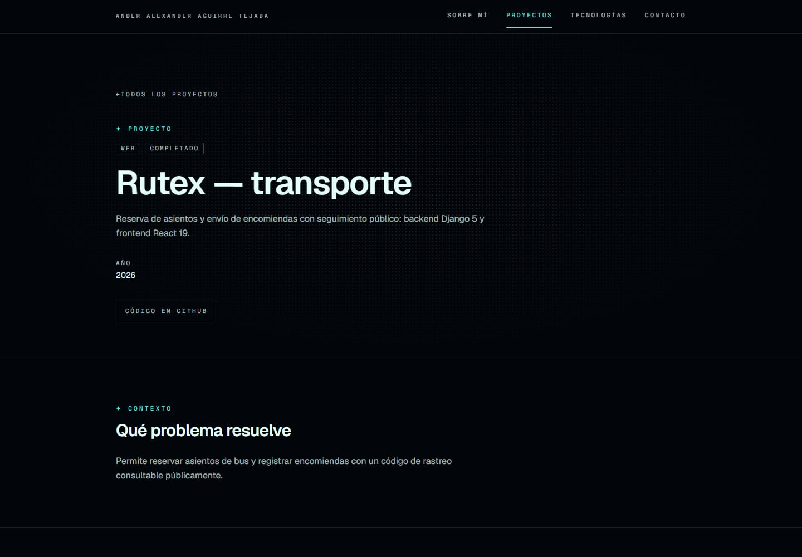
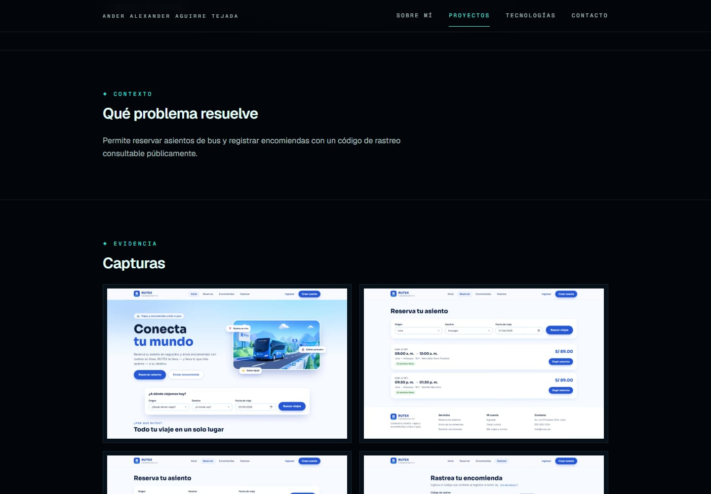
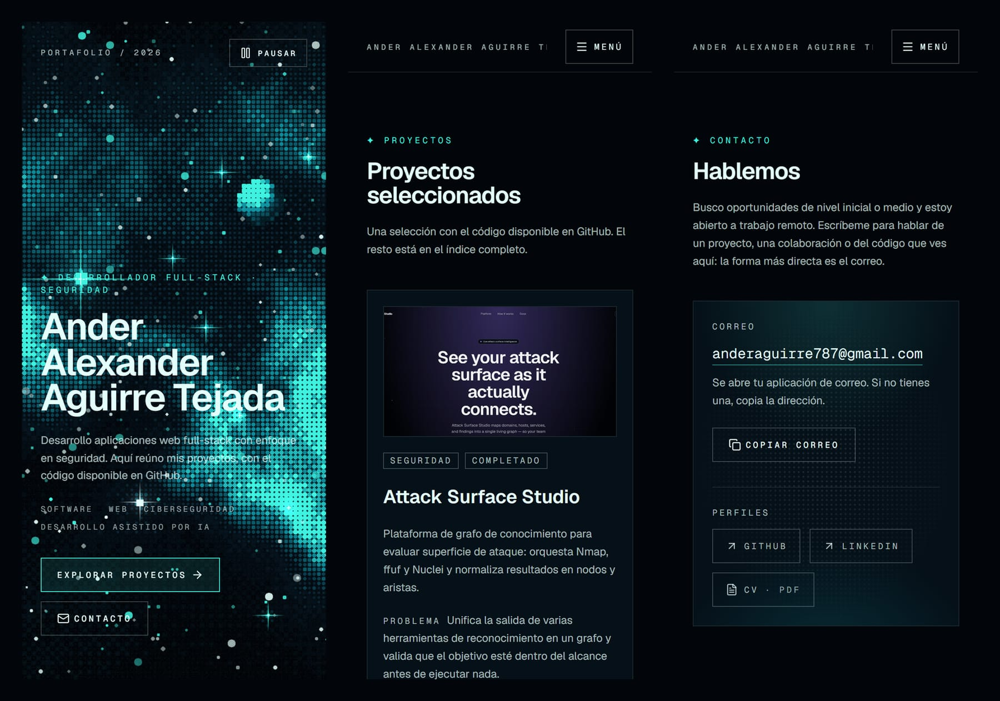

<div align="center">

# Portafolio personal · Ander Aguirre Tejada

**Desarrollador full-stack · Seguridad** — un portafolio que demuestra con proyectos reales lo que sé construir, con el código a la vista en GitHub.




</div>

> **Demo:** pendiente de despliegue (Fase 6). Mientras tanto se ejecuta en local, ver [Puesta en marcha](#puesta-en-marcha).

## Qué es

Un portafolio mayormente estático, con la interfaz en español, pensado para que alguien que revisa mi trabajo (reclutador, equipo técnico) encuentre en pocos minutos **quién soy, qué construyo, con qué tecnologías y dónde está el código**. Los proyectos y la evidencia técnica son el centro; la decoración está al servicio de eso.

La pieza visual es un **Hero en WebGL2** (`HalftoneNebula`, preset `abyssal`): una nebulosa de puntos de semitono con una lámpara que sigue al puntero. Todo el resto del sitio se construye con la misma gramática visual —verde azulado sobre casi negro, etiquetas en monoespaciada con tracking, controles cuadrados, trama de puntos— usando solo CSS, para que parezca un único sistema.

### Principios

- **Sin datos inventados.** Cada dato sale de mis repositorios o de información que yo he aportado. Lo que falta se marca como `[[PLACEHOLDER: …]]` y el script `npm run placeholders` lo lista.
- **Transparencia sobre la IA.** Construyo muchos sistemas con Claude Code: reviso y pruebo el resultado y resuelvo los problemas. También sé programar y corregir errores a mano; con IA simplemente es más rápido. El sitio lo dice de forma explícita.
- **Estático primero.** No hay backend ni formulario: el contacto es un `mailto:` con botón de copiar. `server/` existe vacío y diferido a propósito.
- **Solo el Hero usa WebGL.** El resto son derivados en CSS (trama de puntos, brillo que sigue al puntero, aparición progresiva), con respeto a `prefers-reduced-motion`.

## Capturas

### Escritorio

| | |
|---|---|
|  |  |
| **Sobre mí** · datos reales, tres pilares y nota sobre cómo trabajo con IA | **Proyectos seleccionados** · portada, estado, categoría y stack |
|  |  |
| **Tecnologías** · agrupadas, con enlace a los proyectos que las usan | **Contacto** · `mailto:`, copiar con aviso accesible, perfiles y CV |

### Proyectos

| | |
|---|---|
|  |  |
| **Índice** · filtros por categoría, estado y tecnología guardados en la URL | **Detalle** · problema, stack enlazado, notas de seguridad si las hay |



*Galería de un proyecto con visor ampliado (cuadro de diálogo nativo, foco atrapado, flechas y Escape).*

### Móvil



## Rutas

| Ruta | Contenido |
|---|---|
| `/` | Una sola página con las secciones `#inicio` (Hero), `#sobre-mi`, `#proyectos`, `#tecnologias` y `#contacto` |
| `/proyectos` | Índice completo con filtros (categoría, estado, tecnología) |
| `/proyectos/:slug` | Detalle de cada proyecto, dirigido por datos |
| `*` | 404 con el mismo estilo del sitio |

La barra superior aparece al salir del Hero (el Hero se mantiene intacto) y siempre en el resto de rutas. El primer elemento enfocable es un enlace «Saltar al contenido».

## Tecnologías

| Área | Elección |
|---|---|
| Interfaz | React 19, TypeScript estricto, Vite 8, `react-router` |
| Estilos | Tailwind CSS v4 (tokens en `@theme`), shadcn/ui (`base-nova` sobre `@base-ui/react`), `lucide-react`, tipografías Geist y Geist Mono autoalojadas |
| Hero | WebGL2 propio, sin librerías de gráficos |
| Calidad | oxlint, Vitest + Testing Library (jsdom), Playwright + axe-core, GitHub Actions |
| Imágenes | `sharp` solo en desarrollo (`npm run images`): AVIF, WebP y JPEG por tamaño |
| Servidor | Node + TypeScript, vacío (diferido) |

Dependencias de ejecución: `react`, `react-dom`, `react-router`, `tailwindcss`, `lucide-react` y utilidades de estilos (`clsx`, `tailwind-merge`, `class-variance-authority`, `tw-animate-css`) más las fuentes. Cualquier dependencia nueva se justifica en el commit.

## Cómo está hecho

- **Datos tipados y validados.** Perfil, tecnologías y proyectos viven en `client/src/data/`. El esquema de proyecto (`project.schema.ts`) valida sin dependencias: slugs, estados, URLs `https`, textos alternativos obligatorios, duplicados… Añadir un proyecto es editar datos (y generar sus imágenes), no tocar componentes.
- **Componentes de presentación sin copy.** Los textos están en `data/`; los componentes no los contienen.
- **Primitivas propias** en `components/ui/`: `Eyebrow`, `ActionLink`, `DotGrid`, `Reveal`, `GlowCard`, `Badge`, `ExternalLink`, `SocialLinks`, `CopyButton`, `CvLink`, `ResponsiveImage`.
- **Inmutabilidad y funciones puras** en selectores y filtros (`lib/projects.ts`, `lib/project-filters.ts`).
- **Estado en la URL** para los filtros del índice (`?categoria=…&tec=…&estado=…`), con listas blancas.

## Accesibilidad

Es una puerta de calidad, no un retoque final (objetivo WCAG 2.2 AA):

- HTML semántico, un `h1` por ruta, enlace para saltar al contenido, foco visible y navegación completa con teclado.
- El Hero tiene un botón **Pausar** (WCAG 2.2.2) y respeta `prefers-reduced-motion` en todo el sitio.
- El aviso de «Correo copiado» o el fallo al copiar se anuncian en una región `status`.
- Texto alternativo real en cada captura; el visor de imágenes atrapa el foco y lo devuelve al cerrarse.
- axe-core en las pruebas e2e: 0 violaciones graves o críticas en las rutas probadas.
- Pendiente de la Fase 6: pasada manual con lector de pantalla (NVDA) y revisión de contraste del texto pequeño del Hero.

## Seguridad

- Sin secretos en el repositorio ni en su historial; pruebas estáticas (`security-guard.test.ts`) fallan si aparece una clave, un `target="_blank"` fuera de `ExternalLink` o inyección de HTML.
- Enlaces externos con `rel="noopener noreferrer"`; las URL de los datos deben ser `https`.
- El CV solo admite rutas `/cv/<archivo>.pdf` del propio sitio.
- La dirección de correo se ensambla en tiempo de ejecución (no aparece como texto plano en el código) para dificultar la recolección trivial; es pública por decisión propia.
- Sin analíticas ni scripts de terceros; las fuentes se sirven desde el propio sitio.
- Las cabeceras de seguridad (CSP, etc.) se configuran en el hosting durante la Fase 6.

## Puesta en marcha

Requisitos: Node 24 y npm.

```bash
# Frontend  → http://localhost:5173
cd client
npm install
npm run dev
```

| Comando (en `client/`) | Para qué |
|---|---|
| `npm run dev` | Servidor de desarrollo (incluye `/__kit`, galería de primitivas solo en desarrollo) |
| `npm run build` / `npm run preview` | Compilación de producción y vista previa |
| `npm run typecheck` · `npm run lint` | TypeScript y oxlint |
| `npm test` · `npm run test:coverage` | Pruebas unitarias y de componentes; umbral de cobertura del 80 % |
| `npm run test:e2e` | Playwright (Chromium) + axe sobre el build de producción |
| `npm run images -- <slug> <carpeta>` | Convierte capturas a AVIF/WebP/JPEG y devuelve las entradas de datos |
| `npm run placeholders` | Lista los `[[PLACEHOLDER]]` pendientes |

`server/` (`npm run typecheck`, `lint`, `build`) está vacío a propósito. La CI (`.github/workflows/ci.yml`) ejecuta typecheck, lint, pruebas, build y e2e en cada push y pull request.

### Estado de calidad

| | |
|---|---|
| Pruebas unitarias y de componentes | 459 en 63 archivos, cobertura de ~98 % (sin el Hero WebGL, cubierto por un test e2e) |
| Pruebas e2e | 65 en Chromium: navegación, Hero, proyectos, detalle, contacto, accesibilidad |
| Lighthouse (build de producción, página de detalle, Fase 4) | Escritorio: rendimiento 100, accesibilidad 100, buenas prácticas 100 · Móvil: rendimiento 97 |
| JavaScript inicial | ~141 KB comprimido; el reparto por rutas llega en la Fase 6 |

## Estructura

```text
client/
├── src/
│   ├── app/          router y Layout (salto al contenido, foco, desplazamiento a anclas)
│   ├── pages/        Home, Proyectos, Detalle, 404
│   ├── sections/     hero · about · projects · technologies · contact
│   ├── components/   ui/ (primitivas) · layout/ · projects/
│   ├── data/         perfil, tecnologías, proyectos, esquema y textos
│   ├── hooks/        movimiento reducido, visibilidad, filtros en URL, título de página
│   └── lib/          selectores, medios, correo, portapapeles, validadores
├── public/           favicon, cv/, projects/<slug>/ (imágenes optimizadas)
├── scripts/          optimize-images.mjs, list-placeholders.mjs
└── tests/e2e/        Playwright
server/               Node + TypeScript, vacío (diferido)
```

## Hoja de ruta

| Fase | Contenido | Estado |
|---|---|---|
| 1 | Cimientos y sistema de diseño (tokens, primitivas, herramientas de prueba) | ✅ |
| 2 | Navegación, Sobre mí y Tecnologías | ✅ |
| 3 | Proyectos: modelo, destacados, índice y filtros | ✅ |
| 4 | Detalle de proyecto, medios y galería | ✅ |
| 5 | Contacto, CV, pie de página, CTA y 404 | ✅ |
| 6 | Pulido: responsive, accesibilidad, rendimiento, SEO y despliegue | en curso |

## Contacto

- Correo: se muestra y se copia desde la sección de contacto del sitio.
- GitHub: [Alex350-coder](https://github.com/Alex350-coder)
- LinkedIn: [Ander Aguirre Tejada](https://www.linkedin.com/in/ander-aguirre-tejada-76318333a)
